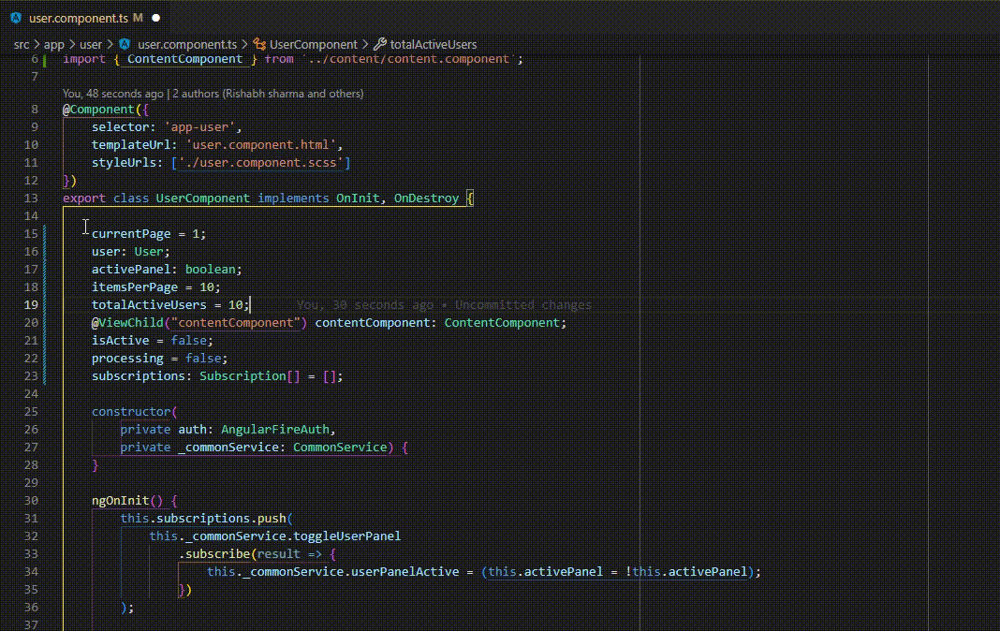

This extension helps you to group variables of an Angular Component under heads likes Inputs, Outputs, Booleans, Properties, Objects, etc.

To group the varibles under the above mentioned heads, select the variables and run the command `Group Variables`.

